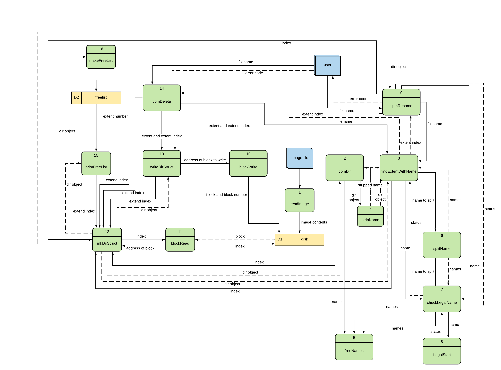

<!-- `pandoc report.md -o project.pdf --from markdown --template eisvogel --listing --toc` -->

\newpage

# Introduction

## Problem Description

File systems are an extremely important, yet often overlooked, part of an operating system.
Without them recovering reading and writing data from a disk would be near impossible.
A good file system is just as important as a good graphical user interface.

This project is tasked with implementing the CP/M file system.
A popular system during the 1970s and 80s.
This file system provides thirty eight different user calls, however, we are only tasked with implementing nine.

A CP disk is made up of 256 blocks and each block is 1024 bytes long.
The first block is reserved for the **directory**, which itself is made up of entries 32 bytes long.
Each entry describes an extent which pretty much describes information for a file.
Each extent contains a status marker, a filename, an extension, an extent number, the number of bytes past the last full 128-byte sector, the number of 128-byte sectors used, and a list of blocks where the files data is stored.

# Design and Implementation

## Design



With this project most of the design was already predetermined by the professor.
The initial files were `cpmfsys.c`, `cpmfsys.h`, `diskSimulator.c`, `diskSimulator.h`, `fysdriver.c` and `image1.img`.
The task of the project was to fill in `cpmfsys.c` with the function prototypes declared in its header file.
`diskSimulator.c` provides the functionality with interacting with the simualted hardware and `fysdriver.c` is our driver function that contains main.
`image1.img` is a "disk" image provided by the professor to be used for debugging purposes within `fsysdriver.c`.

Within `cpmfsys.c` we were tasked with implementing nine functions: `mkDirStruct`, `writeDirStruct`, `makeFreeList`, `printFreeList`, `findExtendWithName`, `checkLegalName`, `cpmDir`, `cpmRename`, and `cpmDelete`.
Most of the functions are self explanatory but we will quickly discuss them.

## Implementation

### mkDirStruct

Takes in an index and an address.
The index is used to determine which extend to grab, and the address is used to determine the base address.
I did not see a use for the address parameter as for the functions we needed to implement only the first block of the disk was needed.
The first block is the *directory*.
This contains extent entries of 32 bytes long that contain metadata for the files within the file system.
Note: index is multiplied by 32 as each extent entry is 32 bytes long.

Therefore, we will need to grab the first block from the disk and offset it by index*32.
This offset will allow the program to grab the extent requested by the user.
Once the address is located that points to the extent information `memcopy` is used to copy the information from the disk into a dirStruct object.
this object is then returned so the function calling `mkDirStruct` can use it.

Originally I wanted to perform one `memcopy` to pull all the data, but how the strings were stored in the disk image this was not possible.
The struct expects 9 bytes for filename and 4 for extension; the extra byte is for the nully byte.
However, when they were stored in the disk image and then stored onto the disk array, the filename and extension were only give 8 and 3 bytes, respectively.

```c
DirStructType *mkDirStruct(int index, uint8_t *e)
{
    DirStructType *dir = malloc(sizeof(DirStructType));

    // read blob from disk
    uint8_t *block = calloc(1, 1024);
    blockRead(block, 0);

    block += index * 32;
    int block_offset = 0;

    // copy status over
    memcpy(&dir->status, block + block_offset, sizeof(dir->status));
    block_offset += sizeof(dir->status);

    // copy the strings seperately as they need to bring over the null byte
    // this null byte is not stored on disk... for some reason
    memcpy(&dir->name, block + block_offset, sizeof(dir->name) - 1);
    block_offset += sizeof(dir->name) - 1;
    memcpy(&dir->extension, block + block_offset, sizeof(dir->extension) - 1);
    block_offset += sizeof(dir->extension) - 1;

    // bring over rest of dir
    memcpy(&dir->XL, block + block_offset, sizeof(DirStructType) - block_offset);

    return dir;
}
```

### writeDirStruct

This function takes in a dirStruct object, an index, and an address.
The dirStruct object needs to be written to the disk and the index tells the program which extent it is.
However, the function that interacts with the hardware can only write 1024 bytes and each extent is 32 bytes long.
Therefore, we will need to grab all the extents in the directory block and write them all back together with the modified extent.

```c
void writeDirStruct(DirStructType *d, uint8_t index, uint8_t *e)
{
    uint8_t *block = calloc(1, 1024);
    uint8_t *offset;

    DirStructType *tmp;
    for (int i = 0; i < MAX_EXTENTS; i++)
    {

        // when loop equals our index don't pull dir from disk
        // rather use one that is passed in as this was the one that has
        // been changed
        if (i == index)
        {
            tmp = d;
        }
        else
        {
            tmp = mkDirStruct(i, NULL);
        }
        offset = block + i * 32;
        int block_offset = 0;

        // copy status over
        memcpy(offset + block_offset, &tmp->status, sizeof(tmp->status));
        block_offset += sizeof(tmp->status);

        // copy the strings separately as they need to bring over the null byte
        // this null byte is not stored on disk... for some reason
        memcpy(offset + block_offset, &tmp->name, sizeof(tmp->name) - 1);
        block_offset += sizeof(tmp->name) - 1;
        memcpy(offset + block_offset, &tmp->extension, sizeof(tmp->extension) - 1);
        block_offset += sizeof(tmp->extension) - 1;

        // bring over rest of dir
        memcpy(offset + block_offset, &tmp->XL, 32 - block_offset);

        free(tmp);
    }
    // write block to disk
    blockWrite(block, 0);
}
```

### makeFreeList

This function will fill a global list to tell the program which blocks are in use or not in use.
First we will clear the existing free list and set everything but the first block to free.
The first block contains the directory so it is always in use.
After that the block 0, the directory, will be enumerated and `mkDirStruct` will create extent objects for each extent.
Each extent's block list will be enumerated to determine where the data is stored.
For example, if extent zero is stored at block one, two, ten, and eleven then we will set `freelist` one, two, ten and eleven will be set to non-free.

```c
void makeFreeList()
{
    // clear freelist, skip first block as it is dir
    for (int i = 1; i < 256; i++)
    {
        freelist[i] = 0;
    }

    // recalculate free list
    for (int i = 0; i < MAX_EXTENTS; i++)
    {
        DirStructType *dir = mkDirStruct(i, NULL);
        if (dir->status != UNUSED) // unused blocks are free'd -- don't check
        {
            for (int i = 0; i < 16; i++)
            {
                int index = dir->blocks[i];
                if (index != 0)
                {
                    freelist[index] = 1;
                }
            }
        }
    }
}
```

### printFreeList

 This function will enumerate through the global free list and print "\*" if the block is in use or "." if it is not.
 Additionally, it prints it as a 16 by 16 block of "\*"s or "."s for formatting purposes.

```c
void printFreeList()
{
    makeFreeList();
    char output;
    printf("FREE BLOCK LIST: (* means in-use)\n");
    for (int i = 0; i < 256; i++)
    {
        if (i % 16 == 0)
        {
            printf("%3x: ", i);
        }
        if (freelist[i] == 1)
        {
            output = '*';
        }
        else
        {
            output = '.';
        }

        printf("%c ", output);
        if ((i + 1) % 16 == 0)
        {
            printf("\n");
        }
    }
}
```

### findExtentWithName

This function takes in a string and a block address this data is passed to mkDirStruct to return a directory object to be analyzed by this function.
After the directory object is returned this function will check to see if the passed string matches the directories filename and extension.

```c
int findExtentWithName(char *name, uint8_t *block0)
{
    if (checkLegalName(name) == true)
    {
        char **names = splitName(name);
        char *filename = names[0];
        char *extension = names[1];

        for (int i = 0; i < MAX_EXTENTS; i++)
        {
            DirStructType *dir = mkDirStruct(i, block0);
            if (dir->status != UNUSED)
            {
                // strip filename and extension of spaces
                char **name = stripName(dir);

                if (strcmp(name[0], filename) == 0 && strcmp(name[1], extension) == 0)
                {
                    return i;
                }
            }
        }

        return -1;
    }
    else
    {
        return -1;
    }
}
```

### checkLegalName

Takes in a string and checks are performed on it to determine if it is "legal".
A file's name can only be 8 bytes long max and its extension can only be 3 bytes max.
The first character of the file name and the extension has to be either a-z, A-Z, or 0-9.
So for example "-file.txt" is an illegal filename.

```c
bool checkLegalName(char *name)
{
    bool return_code;
    // name cannot be empty
    if (strcmp(name, "") == 0)
    {
        return_code = false;
    }
    else
    {
        char **names = splitName(name);
        char *filename = names[0];
        char *extension = names[1];

        // incorrect filename length
        if (strlen(filename) > 8)
        {
            return_code = false;
        }
        // incorrect extension length
        else if (strlen(extension) > 3)
        {
            return_code = false;
        }

        // illegal first character
        else if (illegalStart(filename))
        {
            return_code = false;
        }

        // if extension isnt empty check for legal first character
        else if ((strcmp(extension, "") != 0) && illegalStart(extension))
        {
            return_code = false;
        }

        // legal name
        else
        {
            return_code = true;
        }
        freeNames(names);
    }

    return return_code;
}
```

We use the function `illegalStart` to determine if the first character of the filename and the extension is valid.

```c
bool illegalStart(char *name)
{
    int first = (int)name[0];

    if (first < 0x30 || (first > 0x39 && first < 0x41) || (first > 0x5a && first < 0x61) || first > 0x7a)
    {
        return true;
    }

    return false;
}
```

### cpmDir

This function lists all the files on the file system.
Note, this will not print out deleted files as they are no longer active.
The filename and the length for each file / extent are listed when this function is called.

```c
void cpmDir()
{
    printf("DIRECTORY LISTING\n");
    for (int i = 0; i < MAX_EXTENTS; i++)
    {
        DirStructType *dir = mkDirStruct(i, NULL);
        if (dir->status != UNUSED)
        {
            // get dir length
            int full_blocks = 0;

            for (int j = 0; j < 16; j++)
            {
                // looks ahead by one, the last block size is calculated by RC & BC
                if (dir->blocks[j] != 0)
                {
                    full_blocks++;
                }
            }

            // last block is counted with RC and BC
            full_blocks--;
            int length = (dir->RC * 128) + dir->BC + (full_blocks * 1024);

            // merge filename and extension for padding
            char **names = stripName(dir);
            char filename[14];
            sprintf(filename, "%s.%s", names[0], names[1]);

            // pad filename with spaces to get even output
            printf("%-12s %d\n", filename, length);
            freeNames(names);
        }
    }
}
```

### cpmRename

This function takes in two strings: `oldName` and `newName`.
It will try to find an extent that matches with the `oldName` if it is found the name is set to `newName`.
After the name is set for the local instance it is written back to disk with `writeDirStruct` for persistence.
However, if the extent is not found or the `newName` is not legally this function will return an error code.

```c
int cpmRename(char *oldName, char *newName)
{
    int return_code;
    if (checkLegalName(newName) == 0)
    { // invalid new name
        printf("%s is an invalid filename\n", newName);
        return_code = -2;
    }
    else if (findExtentWithName(newName, NULL) != -1)
    { // dest already exists
        printf("%s already exists\n", newName);
        return_code = -3;
    }
    else
    {
        // find extent, then rename, then write to disk
        int location = findExtentWithName(oldName, NULL);
        if (location != -1)
        {
            DirStructType *dir = mkDirStruct(location, NULL);
            char **names = splitName(newName);
            strcpy(dir->name, names[0]);
            strcpy(dir->extension, names[1]);
            writeDirStruct(dir, location, NULL);
            return_code = 0;
        }
        else
        {
            // original file does not exist
            printf("%s does not exist\n", oldName);
            return_code = -1;
        }
    }

    return return_code;
}
```

### cpmDelete

This function takes in a string that acts as the filename for the extent to delete.
The extent is located with `findExtentWithName` and the directory object is pulled with `mkDirStruct`.
The status of this directory is set to 0xE5 (unused) and the directory object is written back to disk.

```c
int cpmDelete(char *name)
{

    uint8_t block;
    int location = findExtentWithName(name, &block);
    if (location != -1)
    {
        DirStructType *dir = mkDirStruct(location, NULL);
        dir->status = UNUSED; // set status to unused -> deleted
        // if we skip unused blocks in the free list these will not be listed
        // saves time as we do not have to clear out the data, the data will
        // simply be cleared when new blocks arrive

        writeDirStruct(dir, location, NULL);
        // free(dir);
        return 0;
    }
    else
    {
        printf("%s does not exist\n", name);
        return -1;
    }
}
```

### Utility Functions

Here are some helper functions implemented by the student.
These were not required for the projects completion but aided in the coding process.

`splitName` takes in a string and splits it on the delimetter ".".
This is used to split a name into filename and extension.
For example if "test.txt" is provided this will return a 2D array that has "test" and ".txt".

This is useful as when names are provided for deletion and renames it takes it in as a full name, not filename and extension separately.
I could have merged the filename and extension for each index but it is easier to split once then merge each time.

```c
char **splitName(char *name)
{
    char str[80];
    strcpy(str, name);

    // split name from extension
    char *filename = strtok(str, ".");
    char *extension = strtok(NULL, ".");

    char **output = malloc(16);
    output[0] = malloc(9);
    output[1] = malloc(4);
    strcpy(output[0], filename);

    // extensions can be null, so if it is dont copy it over
    if (extension != NULL)
    {

        strcpy(output[1], extension);
    }
    else
    {
        strcpy(output[1], "");
    }
    return output;
}
```

`freeName` takes in a string array of two elements and free's the objects.
This is useful as `stripName` and `splitName` both use malloc to allocate memory for the objects.
Once these strings are no longer needed they should be free'd so the memory can be used elsewhere.

```c
void freeNames(char **names)
{
    free(names[0]);
    free(names[1]);
    free(names);
}
```

`stripName` takes in a directory object and returns the stripped version of its name and extension.
When the filename and extension are created they are padded with zeros to ensure they are 8 and 3 bytes long, respectively.
When doing extent comparisons it is easier a user passes in a non padded string, therefore, to perform accurate comparisons one needs to strip the extents variables.

```c
char **stripName(DirStructType *dir)
{
    char name[9];
    char extension[4];
    strcpy(name, dir->name);
    strcpy(extension, dir->extension);

    // split name from extension
    char *stripped_name = strtok(name, " ");
    char *stripped_extension = strtok(extension, " ");

    char **output = malloc(16);
    output[0] = malloc(9);
    output[1] = malloc(4);
    strcpy(output[0], stripped_name);

    // extensions can be null, so if it is don't copy it over
    if (stripped_extension != NULL)
    {

        strcpy(output[1], stripped_extension);
    }
    else
    {
        strcpy(output[1], "");
    }
    return output;
}
```

```c
bool illegalStart(char *name)
{
    int first = (int)name[0];

    if (first < 0x30 || (first > 0x39 && first < 0x41) || (first > 0x5a && first < 0x61) || first > 0x7a)
    {
        return true;
    }

    return false;
}
```

# Conclusion

This project was very interesting as I had never dealt with creating / emulating a file system before.
I have had experience learning about NTFS, FAT, and other popular implementations so I was familiar with how they worked at a high level.
However, creating one was a difference experience altogether.

My only complaint is that I wish the specifications were more clear.
I felt compared to the other specification they were not as polished or explicit in what was wanted from us.
